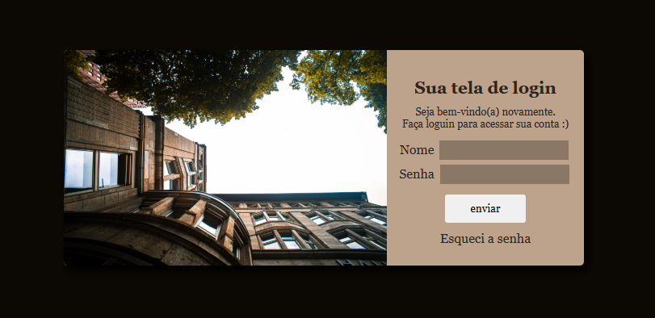

# 🔐 Tela de Login – Desafio Front-end

## 📌 Sobre o Projeto

Este projeto consiste na **criação de uma tela de login**, desenvolvida como um **desafio de front-end** e também como **primeiro contato com formulários HTML**.

O foco principal foi desenvolver um **layout limpo**, com **design moderno**, garantindo boa organização visual e alinhamento correto dos elementos.

---

## 🎯 Objetivo do Projeto

- Criar a primeira **tela de login**
- Trabalhar com **formulários HTML**
- Aplicar boas práticas de **estruturação**
- Desenvolver um layout:
  - Limpo
  - Moderno
  - Funcional
- Praticar alinhamento utilizando **Flexbox**

O projeto teve como foco **aprendizado e prática**, consolidando conceitos essenciais de front-end.

---

## 🛠️ Tecnologias Utilizadas

- HTML5
- CSS3
- Flexbox
- Estruturação de Formulários

---

## 🖥️ Resultado Final

A tela de login apresenta:
- Interface simples e moderna
- Campos bem organizados
- Alinhamento consistente dos elementos
- Boa experiência visual para o usuário

---

## 📸 Screenshot do Projeto

> Espaço reservado para visualização da interface.

*(Substitua `screenshot.png` pelo nome da imagem)*

---

## 📚 Aprendizados

- Criação e estruturaçã

